# Документация

## Для запуска веб-приложения

### В папке backend есть архив instantclient_23_0.rar его необходимо распаковать в той же папке предварительно.

### 1. Перейти в папку backend

```bash
cd backend
```

### 2. Создать и активировать виртуальное окружение

```bash
python -m venv .venv
.venv\Scripts\activate
```
### 3. Установить зависимости

```bash
pip install -r requirements.txt
```

### 4. Запустить приложение

```bash
python app.py
```

### После запуска сервер будет доступен по адресу

```
http://127.0.0.1:5000
```

## 1. SQL-скрипт `sem2_point1.sql`

### 1.1. Назначение скрипта
Скрипт полностью поднимает схему продаж: справочники магазинов/продавцов/покупателей, таблицу продаж, журнал изменений, CRUD-пакет и пакет инструментов журнала.

### 1.2. Создаваемые таблицы
- **SEM_STORE** — справочник магазинов.
  - **STORE_ID** — первичный ключ.
  - **STORE_NAME** — название магазина.
- **SEM_CUSTOMER** — справочник покупателей.
  - **CUSTOMER_ID** — первичный ключ.
  - **FULL_NAME** — ФИО покупателя.
  - **PHONE** — телефон (необязательное поле).
- **SEM_SELLER** — справочник продавцов, привязанных к магазину.
  - **SELLER_ID** — первичный ключ.
  - **FULL_NAME** — ФИО продавца.
  - **STORE_ID** — внешний ключ на `SEM_STORE`.
- **SEM_SALE** — факты продаж.
  - **SALE_ID** — первичный ключ.
  - **STORE_ID** — внешний ключ на `SEM_STORE`.
  - **SELLER_ID** — внешний ключ на `SEM_SELLER`.
  - **CUSTOMER_ID** — внешний ключ на `SEM_CUSTOMER`.
  - **SALE_DATE** — дата продажи.
- **SEM_ENTITY_LOG** — журнал изменений.
  - **LOG_ID** — первичный ключ (заполняется последовательностью).
  - **ENTITY_NAME** — имя сущности (`SELLER`, `CUSTOMER`, `SALE`).
  - **ENTITY_PK** — ключ сущности.
  - **OPERATION** — `INSERT` / `UPDATE` / `DELETE`.
  - **OLD_DATA** — сериализованные старые данные в формате `KEY=VALUE;`.
  - **NEW_DATA** — сериализованные новые данные в формате `KEY=VALUE;`.
  - **OPERATION_DT** — дата операции.

### 1.3. Последовательность и триггер для журнала
- **SEM_ENTITY_LOG_SEQ** — последовательность для генерации `LOG_ID`.
- **SEM_TRG_ENTITY_LOG_ID** — триггер, который присваивает `LOG_ID`, если он не передан явно.

### 1.4. CRUD-пакет `SEM_PKG_CORE_CRUD`
Пакет содержит процедуры для управления продавцами, покупателями и продажами.

#### 1.4.1. Процедуры продавцов
- **ADD_SELLER(p_id, p_name, p_store_id)** — вставляет продавца в `SEM_SELLER`.
- **UPD_SELLER(p_id, p_name, p_store_id)** — обновляет данные продавца по ключу `SELLER_ID`.
- **DEL_SELLER(p_id)** — удаляет продавца по идентификатору.

#### 1.4.2. Процедуры покупателей
- **ADD_CUSTOMER(p_id, p_name, p_phone)** — вставляет запись покупателя в `SEM_CUSTOMER`.
- **UPD_CUSTOMER(p_id, p_name, p_phone)** — обновляет данные покупателя по `CUSTOMER_ID`.
- **DEL_CUSTOMER(p_id)** — удаляет покупателя по ключу.

#### 1.4.3. Процедуры продаж
- **ADD_SALE(p_id, p_store_id, p_seller_id, p_customer_id, p_date)** — создаёт запись продажи в `SEM_SALE`.
- **UPD_SALE(p_id, p_store_id, p_seller_id, p_customer_id, p_date)** — обновляет запись продажи.
- **DEL_SALE(p_id)** — удаляет запись продажи по `SALE_ID`.

### 1.5. Логирующие триггеры
- **SEM_TRG_SELLER_LOG** — пишет операции над `SEM_SELLER` в `SEM_ENTITY_LOG`.
- **SEM_TRG_CUSTOMER_LOG** — пишет операции над `SEM_CUSTOMER` в `SEM_ENTITY_LOG`.
- **SEM_TRG_SALE_LOG** — пишет операции над `SEM_SALE` в `SEM_ENTITY_LOG`.

Каждый триггер формирует `OLD_DATA` и `NEW_DATA` в формате `KEY=VALUE;`.

### 1.6. Пакет `SEM_PKG_LOG_TOOLS`
Пакет для просмотра журнала, отката операций и построения сводок.

#### 1.6.1. Функция
- **GET_VAL(p_kv, p_key)** — извлекает значение из строки `KEY=VALUE;`.

#### 1.6.2. Процедуры
- **VIEW_LOG(p_from, p_to, p_op, p_entity)** — выводит записи журнала с фильтрами.
- **ROLLBACK_ACTION(p_log_id)** — откатывает операцию по записи журнала.
- **SUMMARY_REPORT(p_sort_entity, p_sort_op, p_sort_count)** — строит агрегированную сводку по журналу.

### 1.7. Демо-запуск
В конце скрипта выполняются CRUD-операции и вызываются процедуры просмотра/сводки, чтобы быстро получить примеры записей журнала.

---

## 2. Backend (Python) — `backend/app.py`

### 2.1. База и конфигурация
- **_create_pool()** — создаёт пул соединений Oracle. Использует переменные окружения `ORACLE_USER`, `ORACLE_PASSWORD`, `ORACLE_DSN`.
- **_get_short_path(path)** — (Windows) конвертирует путь к instant client в короткий формат для корректной загрузки DLL.

### 2.2. SQL-хелперы
- **_fetch_all(query, params=None)** — выполняет SELECT и возвращает список словарей.
- **_execute_sql(query)** — выполняет произвольный SQL, возвращая либо выборку, либо число затронутых строк.
- **_call_proc(proc_name, params)** — вызывает хранимую процедуру Oracle и делает commit.

### 2.3. Обработка ошибок
- **handle_exception(error)** — единый обработчик ошибок Flask, возвращающий JSON-ответ.

### 2.4. API эндпоинты справочников
- **list_stores()** → `GET /api/stores` — список магазинов.
- **list_customers()** → `GET /api/customers` — список покупателей.
- **list_sellers()** → `GET /api/sellers` — список продавцов с магазином.
- **list_sales()** → `GET /api/sales` — список продаж с деталями.

### 2.5. CRUD эндпоинты
- **manage_customers()** → `POST /api/customers` — CRUD для покупателей.
- **manage_sellers()** → `POST /api/sellers` — CRUD для продавцов.
- **manage_sales()** → `POST /api/sales` — CRUD для продаж.

### 2.6. Журнал и откаты
- **list_logs()** → `GET /api/logs` — выборка журнала с фильтрами.
- **log_summary()** → `GET /api/logs/summary` — агрегированная сводка.
- **rollback_action()** → `POST /api/logs/rollback` — откат операции по лог-записи.

### 2.7. Технические эндпоинты
- **health()** → `GET /api/health` — health-check сервера.
- **list_tables()** → `GET /api/tables` — список таблиц схемы.
- **table_details(table_name)** → `GET /api/tables/<table_name>` — первые 200 строк таблицы.
- **run_sql()** → `POST /api/sql` — выполнение произвольного SQL.
- **serve_index()** → `GET /` — отдаёт `index.html` фронтенда.
- **serve_static(path)** → `GET /<path:path>` — отдаёт статические файлы фронтенда.

---

## 3. Frontend (React)

### 3.1. Главный компонент `frontend/src/App.jsx`
- **App()** — управляет состояниями данных, вкладками и формами CRUD.
- **showMessage(message, severity)** — отображает toast-уведомление.
- **getErrorMessage(error, fallback)** — извлекает текст ошибки из ответа API.
- **refreshAll()** — загружает магазины/покупателей/продавцов/продажи.
- **loadLogs()** — загружает журнал операций по фильтрам.
- **loadSummary()** — загружает сводку по журналу.
- **loadTables()** — получает список таблиц.
- **handleConnect()** — выполняет health-check и переключает UI в режим работы.
- **handleCustomerAction(action)** — CRUD-операции над покупателями.
- **handleSellerAction(action)** — CRUD-операции над продавцами.
- **handleSaleAction(action)** — CRUD-операции над продажами.
- **handleRollback()** — откатывает операцию по записи журнала.
- **handleSqlRun()** — выполняет SQL-запрос из UI.
- **handleTableOpen(tableName)** — открывает таблицу и загружает строки.

### 3.2. API-клиент `frontend/src/api.js`
- **fetchStores()** — GET `/api/stores`.
- **fetchCustomers()** — GET `/api/customers`.
- **fetchSellers()** — GET `/api/sellers`.
- **fetchSales()** — GET `/api/sales`.
- **fetchLogs(params)** — GET `/api/logs`.
- **fetchLogSummary(params)** — GET `/api/logs/summary`.
- **rollbackLog(payload)** — POST `/api/logs/rollback`.
- **fetchTables()** — GET `/api/tables`.
- **fetchTableData(tableName)** — GET `/api/tables/{tableName}`.
- **executeSql(payload)** — POST `/api/sql`.
- **fetchHealth()** — GET `/api/health`.
- **manageCustomer(payload)** — POST `/api/customers`.
- **manageSeller(payload)** — POST `/api/sellers`.
- **manageSale(payload)** — POST `/api/sales`.

### 3.3. Точка входа `frontend/src/main.jsx`
- **createRoot(...).render(...)** — монтирует React-приложение в DOM-узел `#root`.

## 4. Скриншоты

### Страница подключения
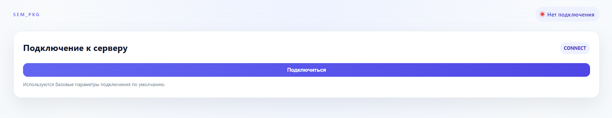

### Главная страница
#### Вкладка SQL запроса
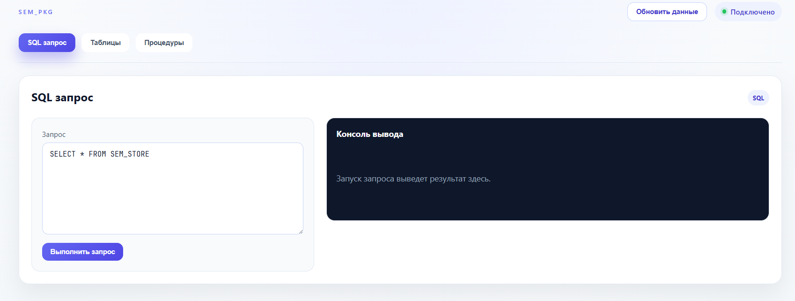

#### Вкладка со всеми таблицами базы данных
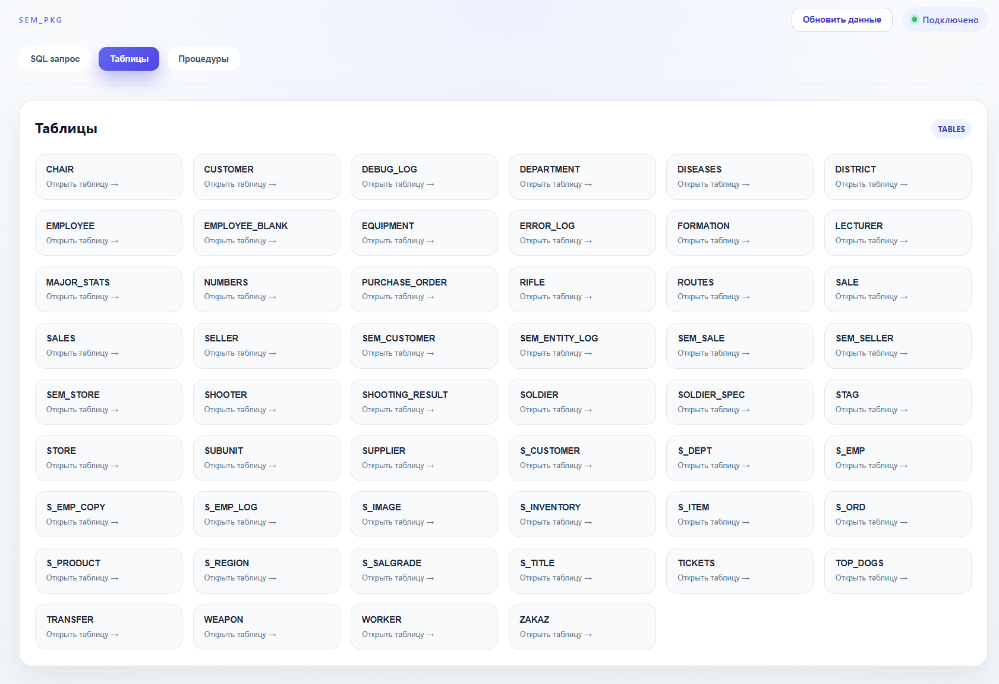

#### Вкладка таблицы с данными
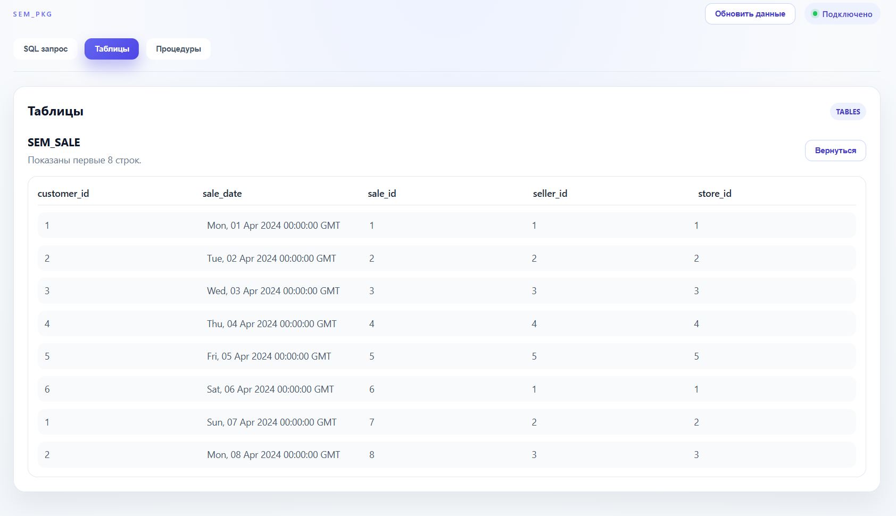

#### Вкладка процедуры: покупатели
 Добавление покупателя
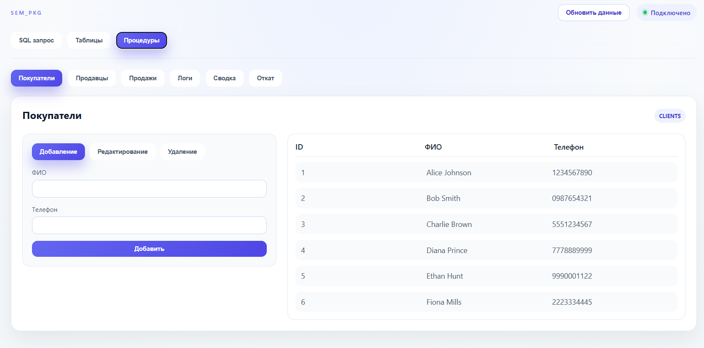

 Редактирование покупателя
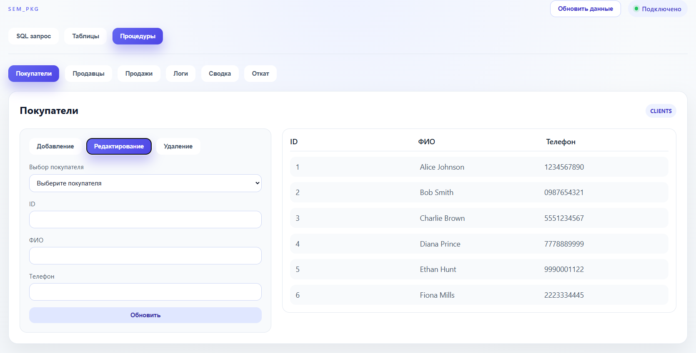

 Удаление покупателя
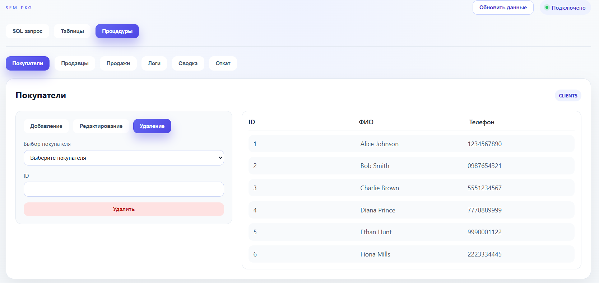

#### Вкладка процедуры: продавцы
 Добавление продавца
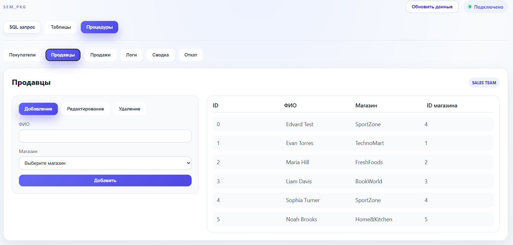

 Редактирование продавца
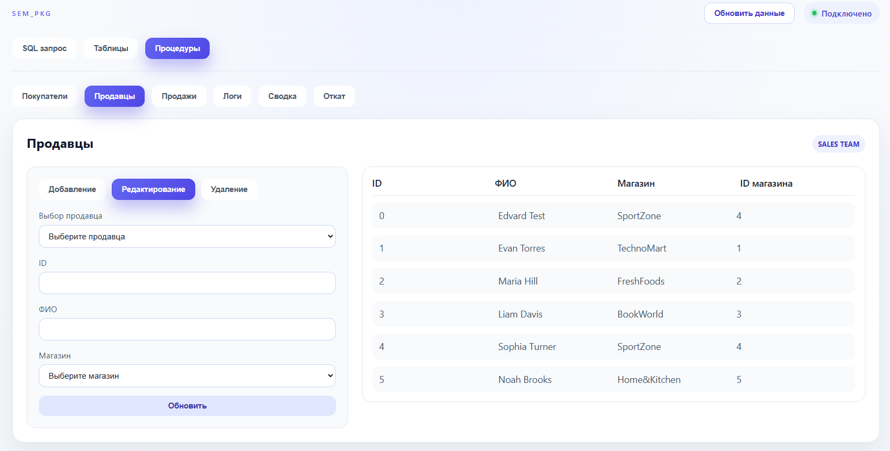

 Удаление продавца
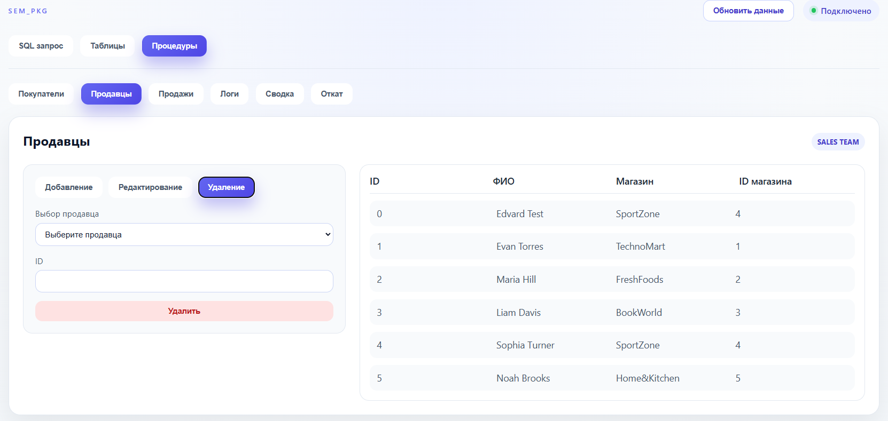

#### Вкладка процедуры: продажи
 Добавление продажи
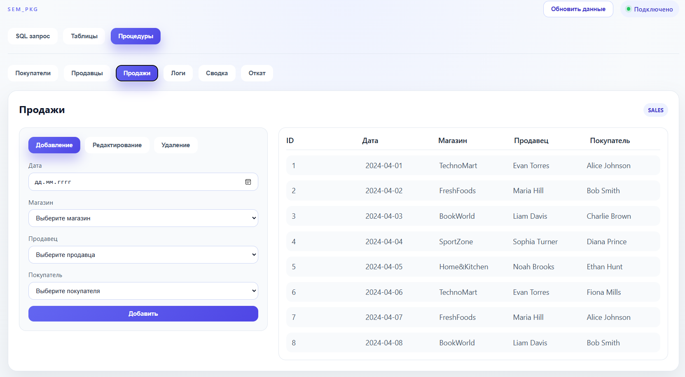
 
 Редактирование продажи
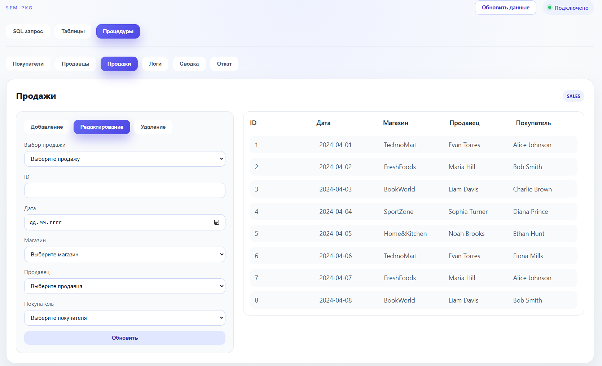
 
 Удаление продажи
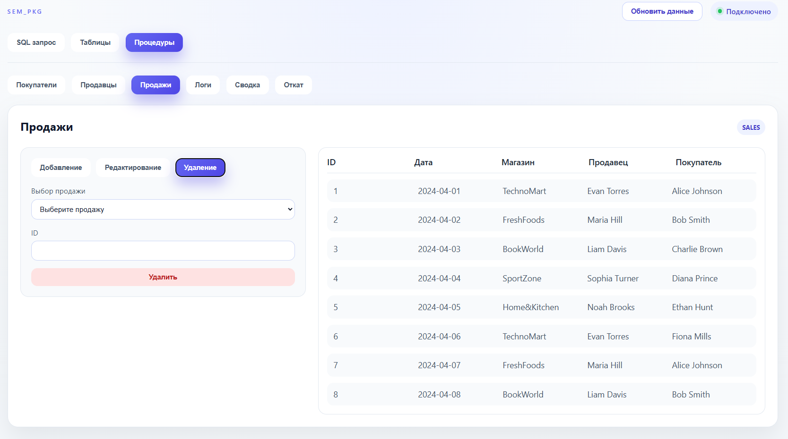
 
#### Вкладка процедуры: логи
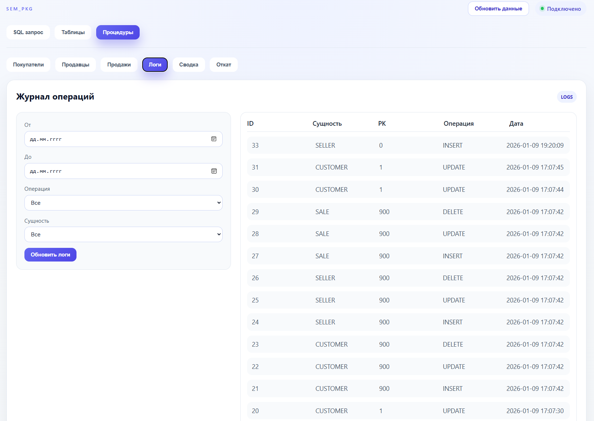

#### Вкладка процедуры: сводка
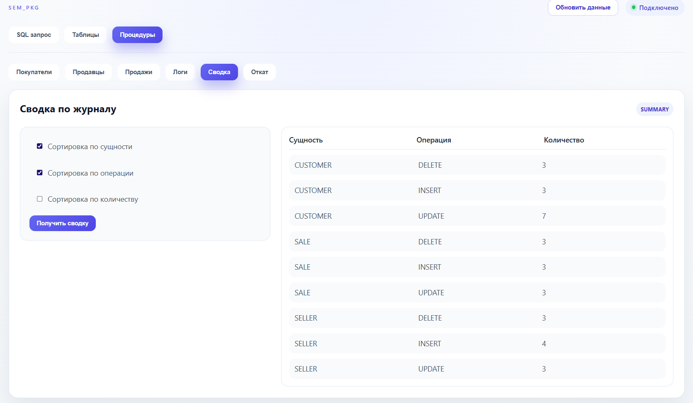

#### Вкладка процедуры: откат
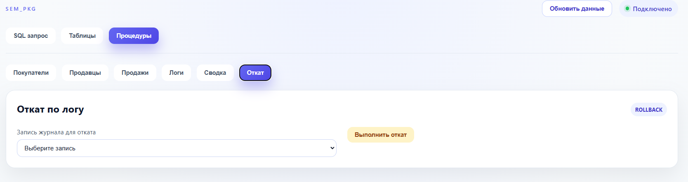